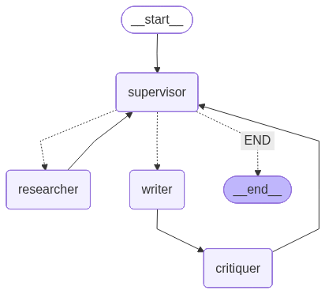

# Multi-Agent Research Assistant

A collaborative **Agent-to-Agent (A2A)** system built using **LangChain** and **LangGraph**, designed to generate detailed and well-structured research reports through intelligent agent cooperation.  

  
*System architecture built with LangGraph illustrating multi-agent collaboration.*

##  Project Structure

```
multi_agent_researcher/
├── assets/
│   └── (graph visualizations saved here)
├── .env
├── requirements.txt
├── prompts.py
├── agents.py
├── graph.py
├── visualize_graph.py
├── app.py
└── README.md
```

##  Installation

### Prerequisites

- Python 3.9 or higher
- pip package manager
- (Optional) Graphviz for graph visualization

### Step 1: Clone or Create Project Directory

```bash
mkdir multi_agent_researcher
cd multi_agent_researcher
```

### Step 2: Install Python Dependencies

```bash
pip install -r requirements.txt
```

### Step 3: Configure Environment Variables

Create a `.env` file in the root directory:

```bash
# Get API key from https://www.together.ai/
TOGETHER_API_KEY=your_together_api_key_here

# Get API key from https://tavily.com/
TAVILY_API_KEY=your_tavily_api_key_here
```

**Getting API Keys:**

1. **Together AI**: Sign up at [together.ai](https://www.together.ai/) and create an API key
2. **Tavily**: Sign up at [tavily.com](https://tavily.com/) and get your API key

### Step 4: (Optional) Install Graphviz for Visualization

**Ubuntu/Debian:**
```bash
sudo apt-get install graphviz graphviz-dev
```

**macOS:**
```bash
brew install graphviz
```

**Windows:**
```bash
choco install graphviz

```

## 🎯 Usage

### Generate Workflow Visualization (Optional)

```bash
python visualize_graph.py
```

This creates a visual diagram of the agent workflow in `assets/research_graph.png`

### Run the Streamlit Application

```bash
streamlit run app.py
```

The app will open in your browser at `http://localhost:8501`

## 🤖 How It Works

The system uses four specialized AI agents that work together:

1. ** Supervisor Agent**
   - Coordinates the entire workflow
   - Decides which agent should work next
   - Manages task delegation

2. ** Researcher Agent**
   - Searches the web for relevant information
   - Uses Tavily search API
   - Gathers and compiles research findings

3. ** Writer Agent**
   - Creates research reports from findings
   - Revises drafts based on feedback
   - Ensures coherent and well-structured output

4. ** Critiquer Agent**
   - Reviews drafts for quality
   - Provides actionable feedback
   - Approves final reports

### Workflow

```
Start → Supervisor → Researcher → Supervisor → Writer → Critiquer → Supervisor
                ↑                                                        ↓
                └────────────────── (loop until approved) ──────────────┘
```

##  Troubleshooting

### Common Issues

**1. Import Errors**
```bash
# Reinstall all dependencies
pip install -r requirements.txt --upgrade
```

**2. API Key Errors**
- Verify your `.env` file is in the project root
- Check that API keys are correct and active
- Ensure no extra spaces in the `.env` file

**3. Together AI Connection Issues**
- The code uses Together AI's OpenAI-compatible endpoint
- Ensure your API key has sufficient credits
- Check network connectivity

**4. Graphviz Installation Issues**
- Graphviz is optional for visualization
- The app will work without it
- If needed, follow
